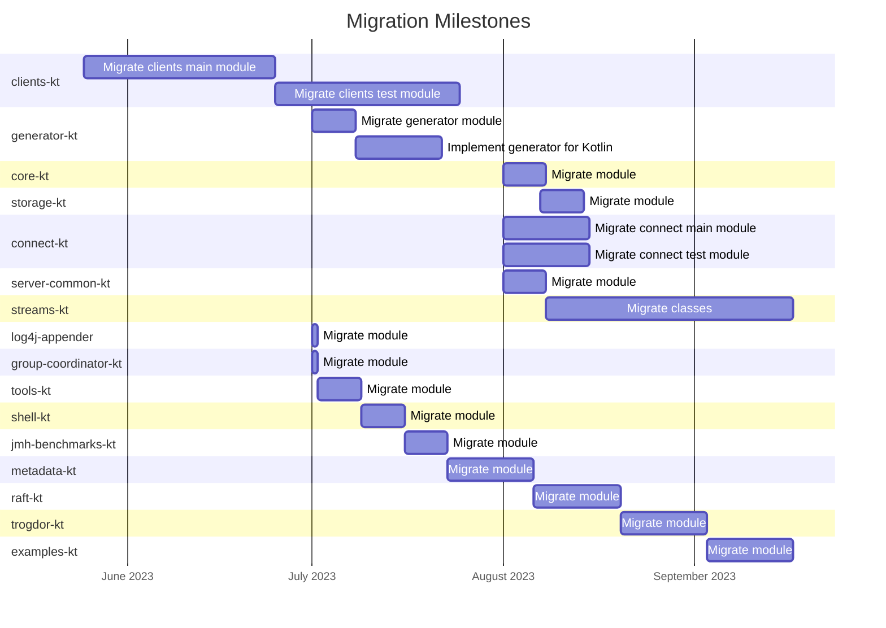
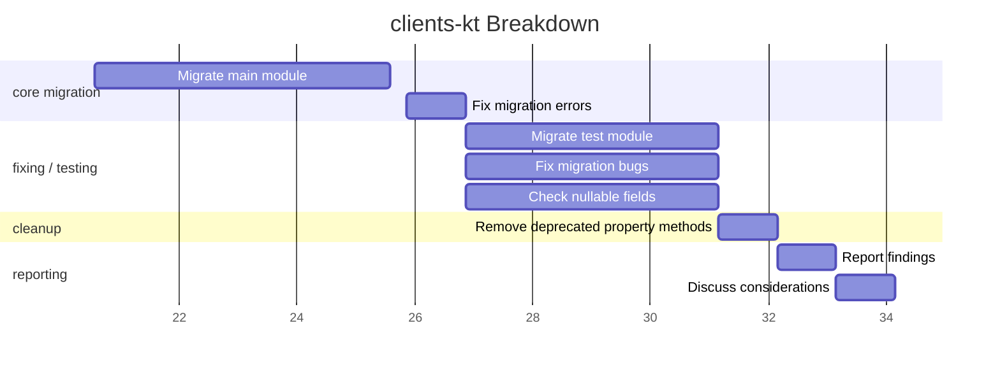

# Migration Status

The below diagram contains a rough overview of the migration progress based on the gradle modules.

## clients-kt Breakdown

The below Gantt diagram contains the details of the clients-kt migration progress.

The following table contains an overview of the tasks related to the clients-kt migration:

| Task                                                     |     Status      |
|----------------------------------------------------------|:---------------:|
| **Migrate clients java module of version 3.4**           |   *Completed*   |
| Optimize class constructors and property methods         | **In progress** |
| Rename modules to -kt instead of -ktx                    |   *Completed*   |
| Fix migration bugs                                       | **In progress** |
| Migrate generator (Java)                                 | **In progress** |
| Implement generator-kt                                   |        ✖        |
| Migrate tests                                            | **In progress** |
| Report founded bugs                                      |        ✖        |
| Rewrite `KafkaFuture` and migrate to Coroutines          |        ✖        |
| Write migration steps for consumers                      |        ✖        |
| Cleanup documentation                                    |        ✖        |
| Update project to latest kafka version                   |        ✖        |
| Update visibility modifiers                              |        ✖        |
| Consider further official Kotlin libraries               |        ✖        |
| Optimize code                                            |        ✖        |
| Replace `.toSet()` with `.toHashSet()` wherever suitable |        ✖        |
